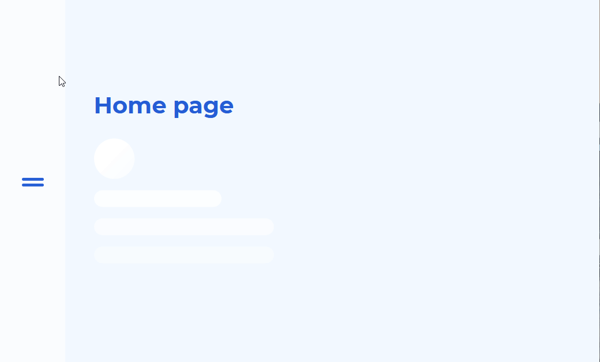

# React Fullpage Loader

Fullpage _React Loader_ that appears when changing routes.

### Preview

### How to use

1. Clone/Download the repo.
2. Install dependencies <code>yarn install</code> or <code>npm install</code>
3. Run <code>yarn start</code> or <code>npm start</code>.
4. You are ready [http://localhost:3000](http://localhost:3000)
